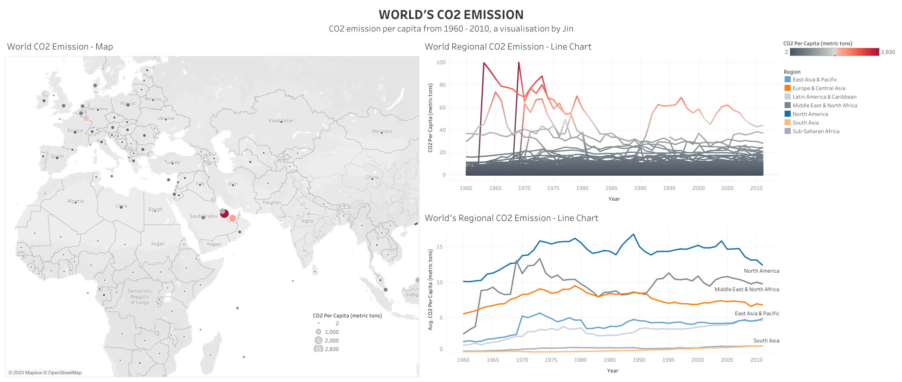

# Data-Visualisation

The following dashboards are made using Tableau Public.

### Dashboard for US retailers

This following data visualisation is about the top retailers in USA.

It is separated into 3 major parts: Revenue, Operational Format and Growth.

This visualisation can also be found at [US Retailers](https://public.tableau.com/app/profile/jin.luo5003/viz/Assignment1_16295280883530/Dashboard1).

From the graphs presented in the dashboard, we can come to multiple conclusions.

### Dashboard for CO2 Emission

The following data visualisation is about CO2 Emission by each country in the world.

The graphs and map are representative of the amount of CO2 emission by each country.

This visualisation can also be found at [CO2 Emission](https://public.tableau.com/app/profile/jin.luo5003/viz/Homework5_16300466723770/Dashboard1).

